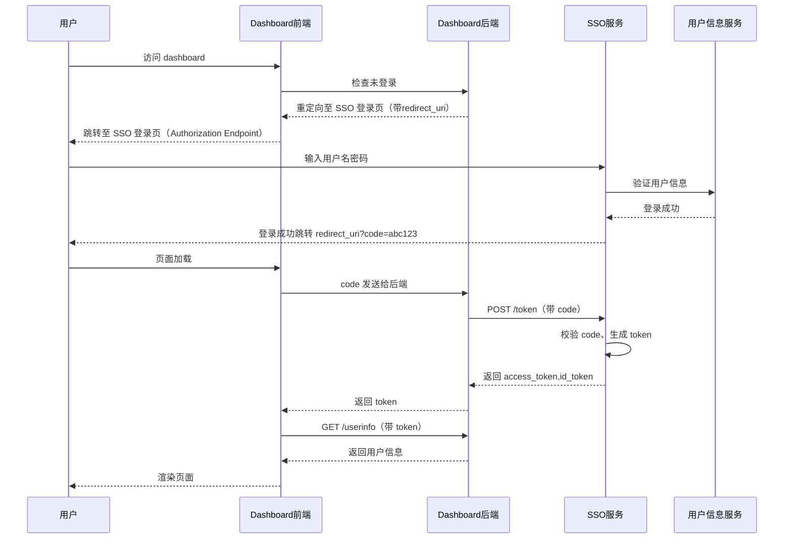

# SSO 统一前端登录/注册

1. 避免重复建设
- 多个系统各自实现登录/注册页面会导致开发、维护、测试工作重复；
- 前端样式、逻辑差异可能引发用户体验不一致。

2. 提升用户体验
- 统一风格、统一流程，用户在多个子系统之间切换不会感到割裂；
- 登录后直接跳转目标系统，无需重新认证。

3. 利于权限与认证逻辑集中管理
- 登录/注册页面中可能涉及验证码、密码策略、OAuth、短信验证等复杂逻辑；
- 集中后这些机制更易统一更新和升级（如接入扫码登录、人脸识别等）。

4. 便于安全管控
- 登录页是攻击的重点对象之一，集中化可加强防护（如滑动验证码、设备指纹、行为风控）；
- 注册页也涉及风控和反作弊，统一后更便于部署统一策略。

✅ 常见的统一实现方式：
| 模式                                 | 描述                                                                         |
| ---------------------------------- | -------------------------------------------------------------------------- |
| **独立前端 Web 应用**                    | SSO 提供一个独立的 login/signup Web 页面（如 `https://sso.xxx.com/login`），所有子系统重定向到这里 |                       |
| **OAuth2 / OpenID Connect + 跳转协议** | 各系统作为 OAuth Client 重定向到统一授权页，登录后带 token 跳转回去                               |

✅ 开发建议
- 前端统一代码库，模块化登录/注册/找回密码等流程；
- UI 层支持皮肤/配置（如不同品牌子系统）；
- 登录页配置支持从 URL 参数或后端 API 获取跳转目标、来源系统名；
- API 接口建议统一走 SSO 服务网关（如 /api/sso/login, /api/sso/register）；

✅ 总结一句话：

登录/注册作为 SSO 的核心功能，强烈建议集中建设前端页面，实现逻辑和风格统一，避免重复开发与维护。

# SSO 单点登录系统

## 时序图



## SSO系统如何为其他系统提供鉴权

用户在 `sso.wristo.io` 登录后，如何安全地跳转并携带 token 给 `dashboard.wristo.io`、`merchant.wristo.io` 等子系统，是 SSO 的关键设计问题。

### ✅ 推荐的方式：基于 OAuth2 / OpenID Connect（OIDC）

#### 1. SSO 作为授权服务器（Authorization Server）

用户访问 `dashboard.wristo.io` → 检查未登录 → 重定向至 `sso.wristo.io/login?redirect_uri=https://dashboard.wristo.io/auth/callback`

#### 2. 登录成功后，SSO 签发一个带有 token 的跳转 URL：

```
https://dashboard.wristo.io/auth/callback?code=abc123
```

#### 3. dashboard 后端通过 code 向 SSO 后台接口（Token Endpoint）换取 Access Token：

```http
POST https://sso.wristo.io/oauth/token
Content-Type: application/x-www-form-urlencoded

grant_type=authorization_code
code=abc123
client_id=dashboard
client_secret=xxx
redirect_uri=https://dashboard.wristo.io/callback
```

**返回：**

```json
{
  "access_token": "eyJhbGci...",
  "expires_in": 3600,
  "refresh_token": "....",
  "token_type": "Bearer",
  "id_token": "...."
}
```

子系统开始使用 token 进行用户鉴权。

### ✅ 核心组成模块

| 模块                         | 说明                                |
| ---------------------------- | ----------------------------------- |
| **SSO 登录页**               | 统一登录页面，用户输入账号密码，或扫码登录等 |
| **Authorization Endpoint**   | 接收来自 dashboard 等系统的跳转请求，登录成功后回跳 |
| **Token Endpoint**           | 子系统拿 `code` 来换取 Access Token |
| **User Info Endpoint**       | 子系统用 Access Token 获取用户信息（如头像、角色等） |

### ✅ 子系统的接入逻辑简化版

1. 用户访问 `dashboard.wristo.io`
2. 检查是否已登录
   - 没登录 → 重定向到 SSO
3. SSO 登录成功 → redirect 回 dashboard（带 code）
4. dashboard 后端 → SSO 换取 token
5. token 存入 cookie / localStorage
6. 开始渲染页面

### ✅ Token 格式（通常是 JWT）

```json
{
  "sub": "user_id_123",
  "email": "abc@wr.com",
  "exp": 1712345678,
  "roles": ["admin"],
  "iss": "sso.wristo.io"
}
```

- 子系统可以校验签名 + 解出用户信息
- 可设置 token 过期、refresh token 等机制

### ✅ 安全建议

- 强制使用 HTTPS
- 使用短时效 code 换 token，防止泄露
- 不建议将 token 明文放在 URL 中（推荐通过后端换取 token）
- 跨域通信时注意设置 `SameSite=None; Secure` 的 Cookie 策略

### ✅ 替代方案（不推荐）

**Cookie 共享域方案（如 .wr.com）**
- 在顶级域上设置 Cookie（`domain=.wr.com`）使子域共享
- 只能在同一主域下使用（如 `sso.wr.com`、`dashboard.wr.com`）
- 不适用于跨主域（如 `sso.wristo.io` 与 `merchant.partner.io`）

### ✅ 总结

使用 OAuth2 + OpenID Connect，是现代 SSO 系统给多个子系统发放 token 的标准方式，安全、可扩展、被广泛采用（如 Google、GitHub 登录）。

---

## 实现 /auth/callback 路由和页面

### ✅ 功能说明

接收 SSO 登录成功后的回调（带 code），主要职责包括：

- 解析 URL 参数中的 code
- 将 code 发送给后端换取 access_token 
- 初始化登录态（保存 token、跳转首页）

### ✅ 实现细节

#### 1. 路由配置

```typescript
// src/router/index.ts
{
  path: '/auth/callback',
  name: 'AuthCallback',
  component: () => import('@/views/AuthCallback.vue'),
  meta: { requiresAuth: false }
}
```

#### 2. API 接口

```typescript
// src/api/auth.ts
export interface TokenResponse {
  access_token: string
  refresh_token?: string
  expires_in: number
  token_type: string
  id_token?: string
}

export const exchangeCode = (code: string): Promise<ApiResponse<TokenResponse>> => {
  return instance.post('/public/sso/exchange-code', { code })
}
```

#### 3. 用户状态管理

```typescript
// src/store/user.ts
async fetchUserInfo() {
  if (!this.token) {
    throw new Error('未登录')
  }
  const response = await getUserInfo()
  if (response.data) {
    this.userInfo = response.data
    localStorage.setItem('userInfo', JSON.stringify(this.userInfo))
    return response.data
  }
  throw new Error(response.msg || '获取用户信息失败')
}

setToken(token: string) {
  this.token = token
  localStorage.setItem('token', token)
}
```

#### 4. 回调页面组件

```vue
<!-- src/views/AuthCallback.vue -->
<template>
  <div class="auth-callback">
    <div class="loading-container">
      <div class="loading-spinner"></div>
      <p class="loading-text">{{ loadingText }}</p>
    </div>
  </div>
</template>

<script setup lang="ts">
import { ref, onMounted } from 'vue'
import { useRouter } from 'vue-router'
import { useUserStore } from '@/store/user'
import { exchangeCode } from '@/api/auth'

const router = useRouter()
const userStore = useUserStore()
const loadingText = ref('正在登录中，请稍候...')

onMounted(async () => {
  try {
    // 解析 URL 参数中的 code
    const urlParams = new URLSearchParams(window.location.search)
    const code = urlParams.get('code')
    const error = urlParams.get('error')
    const errorDescription = urlParams.get('error_description')

    // 检查是否有错误
    if (error) {
      loadingText.value = `登录失败: ${errorDescription || error}`
      setTimeout(() => {
        router.replace('/login')
      }, 3000)
      return
    }

    // 检查是否有 code
    if (!code) {
      loadingText.value = '缺少授权码，请重新登录'
      setTimeout(() => {
        router.replace('/login')
      }, 3000)
      return
    }

    loadingText.value = '正在验证授权码...'

    // 将 code 发送给后端换取 access_token
    const response = await exchangeCode(code)
    
    if (response.code === 200 && response.data) {
      loadingText.value = '登录成功，正在跳转...'
      
      // 保存 token 到 store 和 localStorage
      userStore.setToken(response.data.access_token)
      
      // 如果有 refresh_token，也保存
      if (response.data.refresh_token) {
        localStorage.setItem('refresh_token', response.data.refresh_token)
      }
      
      // 更新用户状态
      await userStore.fetchUserInfo()
      
      // 跳转到首页或目标页面
      const redirectTo = urlParams.get('redirect_uri') || '/'
      router.replace(redirectTo)
    } else {
      throw new Error(response.msg || '换取token失败')
    }
  } catch (error) {
    console.error('Auth callback error:', error)
    loadingText.value = `登录失败: ${error instanceof Error ? error.message : '未知错误'}`
    
    // 3秒后跳转到登录页
    setTimeout(() => {
      router.replace('/login')
    }, 3000)
  }
})
</script>
```

### ✅ 简化建议（可选）

#### 子系统共用统一回调域名

你也可以让多个系统共用同一个回调服务，例如：

```
https://sso.wristo.io/callback?client=dashboard
```

然后：
- SSO 统一处理换 token
- 成功后重定向到目标系统的首页 + token

但这种方式适合耦合度较高的单体系统，不适合前后端完全解耦的多子系统架构。


---

实现 /auth/callback 路由和页面，用于：

✅ 接收 SSO 登录成功后的回调（带 code）
这个路由的主要职责是：

解析 URL 参数中的 code

将 code 发给自己后端换取 access_token 

初始化登录态（如保存 token、跳转首页）


Vue 示例（前端公共组件）

<!-- AuthCallback.vue -->
<script setup>
import { onMounted } from 'vue'
import { useRouter } from 'vue-router'

const router = useRouter()

onMounted(async () => {
  const code = new URLSearchParams(window.location.search).get('code')
  if (!code) return

  const response = await fetch('/api/auth/exchange-code', {
    method: 'POST',
    body: JSON.stringify({ code }),
    headers: { 'Content-Type': 'application/json' }
  })
  const result = await response.json()
  localStorage.setItem('access_token', result.access_token)

  router.replace('/')  // 跳转回首页或目标页面
})
</script>

<template>
  <div>正在登录中，请稍候...</div>
</template>


简化建议（可选）
✅ 子系统共用统一回调域名？
你也可以让多个系统共用同一个回调服务，例如：

arduino
复制
编辑
https://sso.wristo.io/callback?client=dashboard
然后：

SSO 统一处理换 token

成功后重定向到目标系统的首页 + token

但这种方式适合耦合度较高的单体系统，不适合前后端完全解耦的多子系统架构。


